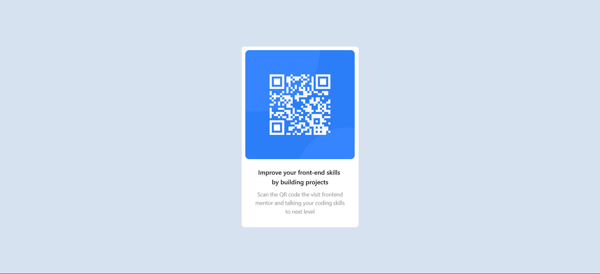

# Frontend Mentor - QR code component solution

This is a solution to the [QR code component challenge on Frontend Mentor](https://www.frontendmentor.io/challenges/qr-code-component-iux_sIO_H). Frontend Mentor challenges help you improve your coding skills by building realistic projects. 

## Table of contents

- [Overview](#overview)
  - [Screenshot](#screenshot)
  - [Links](#links)
- [My process](#my-process)
  - [Built with](#built-with)
  - [What I learned](#what-i-learned)
- [Author](#author)

**Note: Delete this note and update the table of contents based on what sections you keep.**

## Overview

### Screenshot

### Links

- Live Site URL: [Vercel](https://your-live-site-url.com)

## My process

### Built with

 Semantic HTML5 markup
- CSS custom properties
- Flexbox
- Mobile-first workflow
- [Antd](https://ant.design/) -  React UI library
- [React](https://reactjs.org/) - JS library

### What I learned

I have revisited React , css flexbox and mobile workflow ;

## Author

- Website - [Abdulrahman Badr](https://www.linkedin.com/in/abdulrahmanbadr99/)
- Frontend Mentor - [@abdulrahman9901](https://www.frontendmentor.io/profile/abdulrahman9901)
- Twitter - [@Abdulrahman_Bdr](https://twitter.com/Abdulrahman_Bdr)
